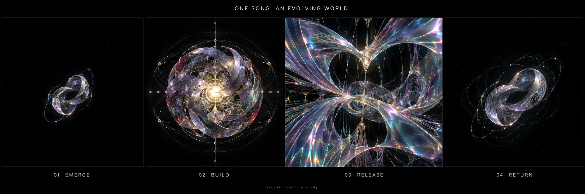
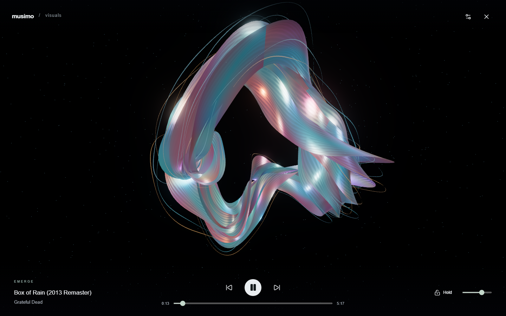

# Visualizer handoff

## Next task

Check out `feature/music-visualizer` in the normal Musimo checkout and continue the custom music visualizer there. Colin rejected the current visual appearance because it does not match the supplied concept. Rebuild the visual layer toward that reference while preserving the working audio/player integration. Show actual rendered progress in the local preview. Do not treat the current renderer as an accepted visual design.

Colin wants a next-generation psychedelic visualizer that develops with the music. Pure visuals fill the screen, with controls revealed by movement or tap. The ambition is musical anticipation and memory, not a collection of unrelated presets. His latest feedback: the implementation looks nothing like the mock, and he asked whether a fresh context would help. The previous implementation did not deliver the visual target. Be candid about that and demonstrate progress before claiming a match.

## Visual target



This is the exact image Colin supplied. Original: `C:/Users/cclea/OneDrive/Desktop/musimo-vis.png`. It is concept art, not a screenshot of a functioning renderer. Exact reproduction in real time has not been established.

The current renderer has broad, mostly opaque metallic ribbons. It lacks the reference's thin translucent membranes, intricate luminous strands, layered depth, bright internal structure and large changes of composition. Adjusting colour and bloom alone will not supply those missing structures.



Build against the four visible compositions:

1. Emerge: a small suspended open knot, extensive dark space, thin refractive surfaces and delicate orbiting strands. The current object is too large and solid.
2. Build: a complex radial structure gathering around a warm luminous centre. Multiple scales of detail and fine connecting threads provide depth.
3. Release: the view enters or unfolds the structure into a frame-filling interior. Preserve continuity through the transformation.
4. Return: recall the original knot with additional fine traces. Preserve its recognisable shape while reflecting the intervening music.

First reproduce the Emerge composition in actual code with a fixed seed/time. Compare a real screenshot to the reference. Then develop Build and Release. Keep camera composition, thin-surface optics, filament structure and light distribution as separate visual problems. The flat grey material backs were fixed, but the underlying appearance remains far from the target. Do not present another generated illustration as proof that the renderer can achieve it.

## Workspace and preview

- The implementation, references and handoff are saved on `feature/music-visualizer`. Colin requested an ordinary branch checkout for further work.
- Previous development worktree: `C:/Users/cclea/projects/musimo-visualizer`. It can remain detached while serving the existing preview.
- Branch: `feature/music-visualizer`, base `c3566550dd00e6f78afc85491746743d9abb8619`.
- Main checkout: `C:/Users/cclea/projects/musimo`. Check its current branch and working changes before switching; preserve unrelated work.
- Live hot preview: `http://127.0.0.1:5174/now-playing`. Vite is running from the worktree's `frontend` directory.
- Main library backend: existing container `musimo-musimo-1` at port 8765.
- Separate analysis/preview backend: container `musimo-visualizer` at port 8768. Its backend code is a read-only bind mount of this worktree, with uvicorn reload. It has a separate `musimo-visualizer-data` volume and uses the existing Navidrome credentials mount. Do not expose credential contents.
- Ignored `frontend/.env` routes ordinary APIs to 8765 and analysis/preview APIs to 8768. Committed Vite config defaults all APIs to 8765. Preserve `changeOrigin: false` or same-origin POST checks fail.
- A local `musimo:visualizer` image was built successfully. Its last build precedes the latest button-spacing change. The hot preview includes that change.
- To preview changes made in a normal checkout, stop the existing Vite process on 5174 and run `npm run dev -- --port 5174 --strictPort` from that checkout's `frontend` directory. Set up its ignored `.env` as described above. The existing server will otherwise keep serving the previous worktree. The analysis backend also reads the previous worktree; update its bind mount if changing backend code in the normal checkout.

## Working pieces to preserve

- `frontend/src/player.tsx`: one persistent audio element, a persistent Web Audio graph, full-screen entry, transport actions, volume through a gain node after analysis, and guarded queue restoration.
- `visualizer-audio.ts` and `visualizer-meter.ts`: native FFT/onset analysis plus an AudioWorklet for block energy and stereo width. The analyser remains available when worklets fail. Closing visuals must keep the audio connection alive.
- `visualizer-director.ts`: musical state, gradual adoption of completed maps, anticipated energy rises, repeated section identities, seek reconstruction and Hold. Section identity comes from coarse harmonic similarity, not melody or instrument recognition.
- `visualizer.tsx`: overlay, transport, settings, saved seeds, Remix, Save, Hold, timing offset, map polling and lifecycle. Preserve these interfaces while replacing rendering.
- `visualizer-renderer.ts`: the rejected visual implementation. Three.js WebGPURenderer, TSL geometry/materials, WebGL fallback, bloom and adaptive resolution. It can be substantially replaced. `WorldState` and `VisualSettings` describe its input contract.
- `backend/visualizer_api.py` and `visualizer_worker.py`: one queued analysis worker using authenticated Navidrome audio, FFmpeg and librosa in a separate process. Private compressed cache, bounded jobs, timeouts, source cleanup and restart recovery.
- `backend/search_api.py`: ID-based preview streaming proxy with validated provider redirects and bounded responses. Foreign preview URLs must use it after the shared element enters Web Audio. Already same-origin preview URLs can play directly. This also preserves the existing generated-audio browser fixture flow.

The latest small UX request is implemented: Start AudioMuse radio and Visualize now sit in a wrapping `.now-actions` flex row with a 12px gap. This is live at port 5174 and the gap was verified in 1440px and 390px viewports.

## Verification and unresolved failure

The complete Python suite passed: 52 tests, 77.98% branch coverage. All six analysis tests also passed inside the Python 3.14 Docker image. Five director tests passed. Type checking, lint, formatting, workflow validation, dependency audits and the Docker build passed. The frontend production build, lint and formatting were checked again after the button-spacing edit. A fresh real-library render had no browser errors and audio continued playing. The temporary packaged-app test container was stopped; the live preview and its analysis backend remain running.

Browser tests have passed the full playback/seek/pause/save/exit/reentry flow on desktop Chromium, mobile Chromium emulation and forced WebGL. The latest packaged run was **5 passed, 1 failed**, not fully green. The analysis-failure test intermittently cannot click Visual settings: the canvas intercepts the click, then controls become hidden. It has occurred on both desktop and mobile in different runs. Extending timeouts did not solve it. Keeping controls visible during startup and restarting the idle timer after renderer readiness helped but did not eliminate it. Diagnose hit testing, control visibility and input timing. Do not claim the bug is fixed based on a single passing retry.

Latest failing trace: `frontend/test-results/visualizer/visualizer-analysis-failur-f7307-ring-and-playback-available-chromium/trace.zip`. Read its sibling `error-context.md`. A separate existing preview playback regression passed against the packaged app. Firefox and real iOS/Safari visualizer operation remain unverified.

Useful commands from the worktree:

```sh
npm run dev --prefix frontend -- --port 5174 --strictPort
npm run test:director --prefix frontend
npm run test:visualizer --prefix frontend
npm run test:e2e:types --prefix frontend
npm run lint --prefix frontend
npm run build --prefix frontend
uv run python -m unittest tests.test_visualizer tests.test_search tests.test_player
```

`MUSIMO_TEST_URL` selects another server for the visualizer tests. Avoid editing served frontend files or running another graphics-heavy browser while those tests run. Vite refreshes can interrupt playback and parallel graphics loads distort timing.

Runtime dependencies are exported with `uv export --locked --no-header --no-dev --no-emit-project --format requirements-txt --output-file requirements.lock`. Do not replace this with a platform-specific `uv pip compile`: that omitted Python 3.14 transitive dependencies and broke the image build.

## Remaining scope

The visual match is the immediate priority. The controls race above remains open. The broader plan also includes instrument separation, stronger phrase recognition, additional visual techniques, next-track preparation, automatic graphics recovery and measured audio/display sync. Those are not delivered. There is no established 60 fps or millisecond sync guarantee. See [current behaviour](visualizer.md) and [broader plan](visualizer-plan.md).

Keep Colin's replies short, show actual renders, and keep the local preview current. Follow his existing repository/global instructions. Do not use a long test report as a substitute for visible artistic progress.
